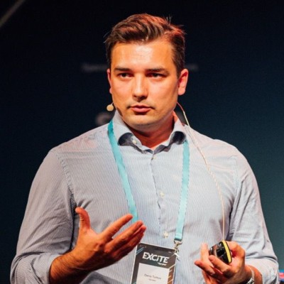

# Denis Turkov

- **Role:** Agentic Engineering Trainer & Consultant, Founder
- **Company:** Execuro / agentic-engineers.dev (ex-Chief Architect at Spryker)
- **LinkedIn:** https://www.linkedin.com/in/turkovdenis/

## About

Berlin-based software architect with 15+ years in large-scale software architecture and e-commerce. Former Chief Architect (VP) at Spryker Systems, now focused on AI-driven engineering and technical consulting through Execuro and agentic-engineers.dev. Co-host and trainer of the Alphalist CTO Bootcamp; interviews Arthur Viegers in the Day 2 Fireside Chat.

